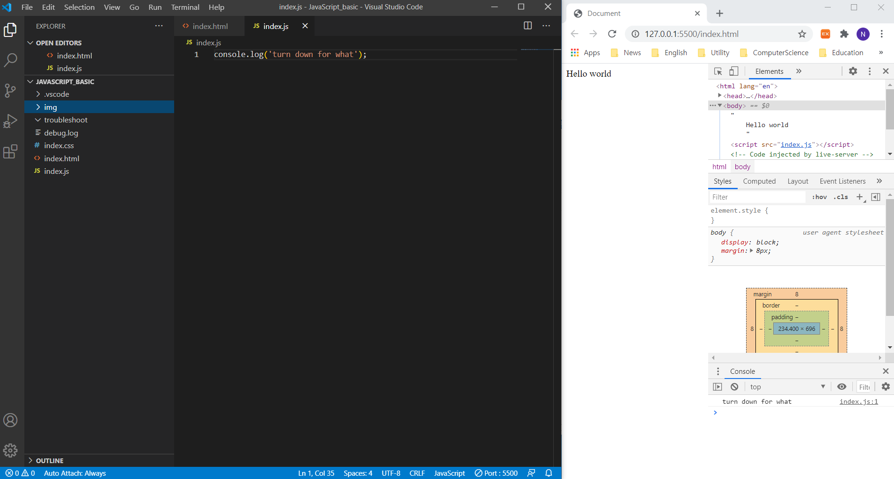

# JavaScript ES6

## efficient screen arrangement
|program|purpose|
|---|---|
|Live Server||
|Bracket Pair Colorizer|Checking easily that what container takes component in complex code set|

```HTML
<html lang="en">
<head>
    <meta charset="UTF-8">
    <meta name="viewport" content="width=device-width, initial-scale=1.0">
    <title>Document</title>
</head>
<body>
    Hello world
    <script src="index.js"></script>
</body>
</html>
```
At console at bottom of developer tools, you can test `console.log("I'm good");` code. If developer has two monitor, these setting gonna be better. If you want to update right page, just press `ctrl + k then s`. These are `save all` shortcut.
<br><br>

## comment
```JS
var number = 5; // in-line comment
/*
    this is a
    multi-line comment
*/
```
<br>

## Data Types and Variables
Different language has different data type system. Below configures are JavaScript Data types. `var` keyword make variable and variable makes computers to store and manipulate data in a dynamic fashion. Variable is like a box so you can contain everything in there.
```JS
Data Types:
undifined, null, boolean, string, symbol, number, and object
```
<br>


**Three ways to declare variable in JavaScript**
```JS
var anyThing = "WCH";
anyThing = 26;

let myHeight = 178;

const pi = 3.14;
```
<br>

## Storing values with assginment operator
```JS
var a;      // declare variable
var b = 2;  // assign 2 to variable
a = 7;
b = a;
console.log(a) // 7
```
<br>

## Initializing variables with assginment operator
```JS
var a = 9;
```
<br>

## Uninitialized variable
```JS
// Initialize these three variables
var a = 5;
var b = 10;
var c = "I am a";
<br>

// Do not change code below this line
a = a + 1;
b = b + 5;
c = c + " String!";
```
<br>

## Case sensitivity in variables
if there are same variable with lower characters name but not same exactly, that cause errors.
<br>

## Arithmetic operating
 ```JS
 // initialize
var a = 8;
var b = 2;

// add
var c = a + b;
console.log(c);
c = c + 1;
c++;
c += b;

// subtract
var c = a - b
console.log(c);
c = c - 1;
c--;
c -= b;

// multiply
var c = a * b;
c *= b;
console.log(c);

// divide
var c = a / b;
c /= b;
console.log(c);

// decimal
var product = 2.0 * 2.5;
console.log(product); // 5

// divide decimal
var quotient = 4.4 / 2.0;
console.log(quotient); // 2.2

// remainder
var remainder;
remainder = 11 % 3;
console.log(remainder) // 2
 ```
<br>
 
 ## String
 ```JS
 // Escaping double quotation mark by back slash
var myStr = "I am a \"double quoted\" string inside \"double quotes\"";
console.log(myStr)

// Escaping quotation mark by single quotes and backtics
var myStr = `'<a href="https://google.com">'`;
console.log(myStr)

// Escape sequence in script
/***** 
\'      single quote
\"      double quote
\\      backslash
\n      newline
\r      carriage return
\t      tab
\b      backspace
\f      form feed
*****/
var myStr = "First Line\n\t\\Second line\nThird line\b";
console.log(myStr);

// Concatenating with plus operator
var concatString = "First sentence. " + "Second sentence.";
console.log(concatString);

var myStr = "First sentence. ";
myStr += "Second sentence.";
console.log(myStr);

// difference between python and javascript
var mulStr = "Multiple ";
mulStr = mulStr * 5;
console.log(mulStr);

// Find length of string
var fullNameLength = 0;
var fullName = "Cheolhwang";
fullNameLength = fullName.length;
console.log(fullNameLength);
console.log(fullName.length);

// Bracket notation to find first character in string
var fullName = "Cheolhwang";
var firstLetter = fullName[0];
console.log(firstLetter)

// String immutability (Can't change after create)
var myStr = "Jello World";
myStr[0] = "H";
console.log(myStr);

// Bracket notation to find N-th, last character in string
var myStr = "One";
nLetter = myStr[1];
lastLetter = myStr[myStr.length - 1];
console.log(nLetter, lastLetter);

// Bracket notation to find N-th to last character in string
var myStr = "Example sentence";
console.log(myStr[myStr.length - 2])

// Word blank by mad libs game
function wordBlanks(myNoun, myAdjective, myVerb, myAdverb)
{
    var result = myAdjective + " " + myNoun + " " + myVerb + " " + myAdverb;
    return result;
}
console.log(wordBlanks("dog", "big", "ran", "quickly"));
 ```
<br>

## Arrays
 ```JS
// Store multiple values with arrays
var myArr = ["CH", 26];
console.log(myArr[0], myArr[1]);

// Nested array
var myArr = [["the universe", 41], ["everything", 1114], 14];
console.log(myArr[2]);

// Access to array data with indexes
var myArr = [50, 60, 70];
console.log(myArr[0], myArr[1], myArr[2]);

// Modify array data with indexes
var myArr = [18, 64, 99];
myArr[1] = 45;
console.log(myArr[1]);
console.log(myArr);

// Access multi-dimensional array with indexes
var myArr = [[1,2,3], [4,5,6], [7,8,9,[10,11,12]]];
console.log(myArr[0][0]);
console.log(myArr[2][3][1]);

// Manipulate arrays with push()
var myArr = ["Stimpson", "J", "cat"];
myArr.push(["happy", "joy"]);
console.log(myArr); // ["Stimpson", "J", "cat", Array(2)]

// Manipulate arrays with plus operator
var myArr = ["J", "cat", 9];
myArr += ["plus", "this"];
console.log(myArr); // J,cat,9plus,this

// Manipulate arrays with pop()
var myArr = [1, 2, 3];
var removedE = myArr.pop();
console.log(removedE);

// Manipulate Arrays with shift(): erase first element
var myArr = ["Stimpson", "J", ["cat"]];
var removedE = myArr.shift();
console.log(removedE); // Stimpson

// Manipulate Arrays with unshift(): unshift adds element front of array
var myArr = ["Stimpson", "J", ["cat"]];
myArr.shift();
myArr.unshift("Happy");
console.log(myArr);

// Shopping List
var myList = [["cereal", 3], ["milk", 2], ["bananas", 3], ["juice", 2], ["eggs", 12]];

 ```
 <br>

 ## Function
```JS
// Basic function structure
function reusableFunction()
{
    console.log("Hello World!");
}
reusableFunction();
reusableFunction();

// Passing values to functions with arguments
var myGlobal = 10;
function functionWithArgs(a, b)
{
    console.log(a + b);
}
functionWithArgs(10, 5); //15

// Global Scope and Functions
function fun1()
{
    // if we declare variable without var keyword, then js automatically know it global
    oopsGlobal = 5;
}

function fun2()
{
    var output = "";
    if (typeof myGlobal != "undefined")
    {
        output += "MyGlobal: " + myGlobal;
    }
    if (typeof oopsGlobal != "undefined")
    {
        output += " oopsGlobal: " + oopsGlobal;
    }
    console.log(output);
}
fun1();
fun2();

// Local scope and fucntions
function myLocalScope()
{
    var myVar = 5;
    console.log(myVar);
}
myLocalScope();
// console.log(myVar); // Uncaught ReferenceError: myVar is not defined at js file

// Global vs Local scope in functoins
var outWear = "T-Shirt";
function outFit()
{
    var outWear = "Sweater";
    return outWear;
}
console.log(outFit());  // Sweater
console.log(outWear);   // T-Shirt

// Return a value from a function with return
function minusSeven(num)
{
    return num - 7;
}
console.log(minusSeven(10));

// Understanding undefined value returned from a function: like void
var sum = 0;
function addThree()
{
    sum += 3;
}
function addFive()
{
    sum += 5;
}
console.log(addThree(5));
console.log(addFive(5));
console.log(sum);

// Assignment with a returned value
var changed = 0;
function change(num)
{
    return (num + 5)/3;
}
changed = change(10);
console.log(changed);

// Stand in line
function nextInLine(arr, item)
{
    arr.push(item);
    return arr.shift();
}
var testArr = [1, 2, 3, 4, 5];

console.log("Before: " + JSON.stringify(testArr));
console.log(nextInLine(testArr, 6));
console.log("After: " + JSON.stringify(testArr));
```
<br>

## Boolean and conditional if statements
```JS
// If statement
function TrueOrFlase(isItTrue){
    if(isItTrue){
        return "Yes, it's true";
    } else {
        return "No, it's false"
    }
}
console.log(TrueOrFlase(false));

// Comparison with the equality operator
function testEqualTen(val){
    if (val == 10){
        return "Equal";
    } else {
        return "Not Equal";
    }
}
console.log(testEqualTen(10));

// Comparison with the strict equality operator
function testStrict(val){
    if (val === 7) {
        return "Equal";
    }
    return "Not Equal";
}
console.log(testEqualTen('10'));
console.log(testStrict(7));
console.log(testStrict('7'));

/* Difference between equal and strictequal
3 == 3      True
3 == '3'    True
3 === 3     True
3 === '3'   False
*/

// Comparison with the inequality operator
function testNotEqualSeven(val){
    if(val != 7){
        return "Not Equal";
    }
    return "Equal";
}
console.log(testNotEqualSeven(5));

// Comparison with the strict inequality operator
function testNotStrictEqualSeven(val){
    if(val !== 7){
        return "Not Eqaul";
    }
    return "Equal";
}
console.log(testNotStrictEqualSeven(7));
console.log(testNotStrictEqualSeven('7'));

// Comparison with logic
function testGreaterThan(val){
    if (val > 10) {
        console.log("it's greater than ten");
    } else if(val == 10){
        console.log("it's equal to ten");
    } else{
        console.log("it's smaller than ten");
    }
}
testGreaterThan(11);
testGreaterThan(10);
testGreaterThan(9);

// Comparison with logical operator (and: &&, or: ||)
function testLogicalOperator(val){
    if(val % 2 == 0 && val % 5 == 0) {
        console.log("this number ends with zero");
    }
    if(val > 0 || val <= 100) {
        console.log("this number is natural number smaller than 100");
    }
}
testLogicalOperator(100)
```
<br>

## Switch
```JS
// Basic switch statement
function caseInSwitch(val){
    var answer= "";
    switch(val){
        case 1:
            answer = 'alpha';
            break;
        case 2:
            answer = "beta";
            break;
        case 3:
            answer = "gamma";
            break;
        default:
            answer = "not in case"
    }

    return answer;
}

var answer = caseInSwitch(4);
console.log(answer)

// Multiple identical options in switch statements
function sequentialSizes(val){
    var answer = "";
    switch(val){
        case 1:
        case 2:
        case 3:
            answer = "Low";
            break;
        case 4:
        case 5:
        case 6:
            answer = "Mid";
            break;
        case 7:
        case 8:
        case 9:
            answer = "High";
            break;
        case 10:
            answer = "Great";
            break;
        default:
            answer = "Not in ten";
            break;
    }
    return answer;
}
answer = sequentialSizes(6);
console.log(answer);

// Returning boolean values from functions
function isLess(a, b){
    if (a < b){
        return true;
    } else {
        return false;
    }
}
console.log(isLess(10, 5));

// Returning early pattern from functions
function abTest(a,b){
    if (a < 0 || b < 0){
        return undefined;
    }

    return Math.round(Math.pow(Math.sqrt(a) + Math.sqrt(b),2));
}
console.log(abTest(4, 2));

// Counting card
var cnt = 0;
function cardCount(card){
    switch(card){
        case 2:
        case 3:
        case 4:
        case 5:
        case 6:
            cnt += 1;
            break;
        case 7:
        case 8:
        case 9:
            break;
        case 10:
        case 'J':
        case 'Q':
        case 'K':
        case 'A':
            cnt -= 1;
            break;
    }

    var holdbet = "Hold";
    if (cnt > 0){
        holdbet = "Bet";
    }
    return cnt + " " + holdbet;
}

cardCount(2); cardCount('K'); cardCount(7); cardCount('K'); cardCount('A');
console.log(cardCount(4)) 
```
<br>

## Objects
```JS
// Dictionary
var myDog = {
    // property: value
    "name": "Bark",
    "legs": 4,
    "tails": 1,
    "friends": ["everything!"]
};

// Accessing object properties with dot notation and bracket notation
var testObj = {
    "hat": "ballcap",
    "shirt": "jersey",
    "two shoes": "cleats"
};

var hatValue = testObj.hat;
var shirtValue = testObj.shirt;
var shoesValue = testObj["two shoes"];

// Accessing object properties with variables
var testObj = {
    12: "Namath",
    16: "Montana",
    19: "Unitas"
};
var playerNumber = 16;
var player = testObj[playerNumber];

// Updating object property (dot notation or bracket notation)
var myDog = {
    "name": "Bark",
    "legs": 4,
    "tails": 1,
    "friends": ["everything!"]
};
myDog.name = "Happy Bark";
console.log(myDog.name);

// Add new properties to an object
var myDog = {
    "name": "Bark",
    "legs": 4,
    "tails": 1,
    "friends": ["everything!"]
};
myDog["bark"] = "woof woof!";

// Delete properties from an object
var myDog = {
    "name": "Bark",
    "legs": 4,
    "tails": 1,
    "friends": ["everything!"]
};
delete myDog.tails;
delete myDog["legs"]

// Using objects for lookups (switch statement can be replaced to object)
function phoneticLookup(val){
    var result = "";

    switch(val){
        case "alpha":
            result = "Adams";
            break;
        case "bravo":
            result = "Boston";
            break;
        case "charlie":
            result = "Chicago";
            break;
        case "delta":
            result = "Denver";
            break;
        case "echo":
            result = "Easy";
            break;
        case "foxtrot":
            result = "Frank";
            break;
    }

    return result;
}

// Testing objects for properties : hasOwnProperty() method
var myObj = {
    gift: "pony",
    pet: "kitten",
    bed: "sleigh"
};

function checkObj(checkProp){
    if(myObj.hasOwnProperty(checkProp)){
        return myObj[checkProp];
    } else {
        return "Not Found";
    }
}
console.log(checkObj("hello!"));

// Manipulating commplex objects
var myMusics = {
    "artists": "Billy Joel",
    "title": "Piano man",
    "release_year": 1973,
    "formats": [
        "CD", "8T", "LP"
    ],
    "gold": true
};

// Nested objects -> use bracket notation or dot notation sequencially
```
<br>

## Iteration
```JS
// Iterate through an array with a while loop
var myArr = [];
var i = 0;
while(i < 5){
    myArr.push(i);
    i++;
}
console.log(myArr);

// Iterate with for loop
var myArr = [];
for(var i = 0; i < 5; i++){
    myArr.push(i);
}
console.log(myArr);

// Iterate with odd numbers with for loop
var myArr = [];
for (var i = 0; i < 10; i+=2) {
    myArr.push(i);
}
console.log(myArr);

// Count backward with loop
var myArr = [];
for(var i = 10; i > 0; i -= 2) {
    myArr.push(i);
}
console.log(myArr);

// Iterate through an array with for loop
var myArr = [9, 10, 11, 12];
var totalNum = 0;
for(var i = 0; i < myArr.length; i++) {
    totalNum += myArr[i];
}
console.log(totalNum);

// Nesting for loops
function multiplyAll(arr) {
    var product = 1;
    for (var i = 0; i < arr.length; i++) {
        for (var j = 0; j < arr[i].length; j++) {
            product *= arr[i][j];
        }
    }
    return product;
}

var product = multiplyAll([[1, 2], [3, 4], [5, 6]]);
console.log(product);

// Iterate with do...while loop
var myArr = [];
var i = 10;
do {
    myArr.push(i);
    i++;
} while(i < 5);
console.log(i, myArr)
```
<br>

## Random
```JS
// Generate random frction
function randomFraction() {
    return Math.random(); // 0 < r < 1
}
console.log(randomFraction());

// Random whole number
var randomBetween0and19 = Math.floor(Math.random() * 20);
console.log(randomBetween0and19);

// Random whole numbers within a range
function randomRange(myMin, myMax) {
    return Math.floor(Math.random() * (myMax - myMin + 1) + myMin);
}
console.log(randomRange(1, 8));
```
<br>

## ParseInt
```JS
// parseInt function
function convertToInteger10(str){
    return parseInt(str);
}
console.log(convertToInteger10("10110"));

// parseInt with a radix
function convertToInteger(str){
    return parseInt(str, 2);
}
console.log(convertToInteger("10110"));
```
<br>

## Ternary operator
```JS
// Basic ternary operator
function checkEqual(a, b) {
    return a===b ? true : false;
}
console.log(checkEqual(7, "7"));
console.log(checkEqual(7, 7));

// Multiple ternary operator
function checkSign(num) {
    return num > 0 ? "Positive" : num < 0 ? "Negative" : "Zero";
}
console.log(checkSign(1));
console.log(checkSign(0));
console.log(checkSign(-1));
```
<br>

## var vs let
Variable declared by `var` keyword could be redundat and replaced, but `let` keyword don't. Another difference between them is scope. When a variable is declared by `var` keyword, it is used globally, on the otherhand `let` keyword makes the variable live just in the declared scope.  
*※ When a functions with identical name in a one JavaScript file, actually execute in same even if each body has different definition.*
```JS
// var scope check
function checkVarScope() {
    var i = "function scope";
    if (true) {
        i = "block scope";
        console.log("Block scope i is: ", i);
    }
    console.log("Function scope i is: ", i);
    return i;
}
checkVarScope();

// let scope check
function checkLetScope() {
    let i = "function scope";
    if (true) {
        let i = "block scope";
        console.log("Block scope i is: ", i);
    }
    console.log("Function scope i is: ", i);
    return i;
}
checkLetScope();
```

## Const
Read-only variable. 
```JS
// Mutate an array declared with const
const myArr = [2, 5, 6];
function mutateArray(s) {
    // myArr = [1, 2, 3]; is impossible but
    s[0] = 1;
    s[1] = 2;
    s[2] = 3;
}
mutateArray(myArr);
console.log(myArr); // [1, 2, 3]

// Prevent object mutation
Object.freeze(myArr);
function mutateArrayWithFreeze(s) {
    try {
        s[0] = 2;
        s[1] = 5;
        s[2] = 6;
    } catch(ex) {
        console.log(ex);
    }
}
mutateArrayWithFreeze(myArr);
console.log(myArr); // [1, 2, 3]
```
<br>

## Anonymous function
```JS
// Use arrow functions to write concise anonymous functions
const magic = () => new Date();
console.log(magic());

// Arrowfunctions with parameters
const myConcat = (arr1, arr2) => arr1.concat(arr2);
console.log(myConcat([1,2], [3, 4, 5]));

// Higher order arrow functions
const realNumberArray = [4, 5.6, -9.8, 3.14, 42, 6, 8.34, -2];
const squareList = (arr) => {
    const squaredIntegers = arr.filter(num => Number.isInteger(num) && num > 0).map(x => x*x);
    return squaredIntegers;
}

const squaredIntegers= squareList(realNumberArray);
console.log(squaredIntegers);

// Default parameter
const increment = (function() {
    return function increment(number, value = 1) {
        return number + value;
    }
})();
console.log(increment(5, 2));
console.log(increment(5));
```
<br>

# rest operator (...)
```JS
/*
const sum = (function(){
    return function sum(x, y, z) {
        const args = [x, y, z];
        return args.reduce((a,b) => a + b, 0);
    };
})();
*/
const sum = (function(){
    return function sum(...args) { // convert arrays and name it args
        return args.reduce((a,b) => a + b, 0);
    };
})();
console.log(sum(1, 2, 3, 4));
```

# spread operator (use to copy array not pointer of array)
```JS
const arr1 = ['JAN', "FEB", "MAR", "APR", "MAY"];
let arr2;
(function(){
    arr2 = [...arr1];
    arr1[0]= 'potato';
})();
console.log(arr1);
console.log(arr2);
```

# Destruct
Execute each part.
```JS
// Destructuring assignment: Objects
var voxel = {x: 3.6, y: 7.4, z: 6.54};
const {x:a, y:b, z:c} = voxel; // get the x from voxel and fill the a 
console.log(a, b, c);

// Destructing assignment: Nested objects
const LOCAL_FORECAST = {
    today: {min: 72, max: 83},
    tomorrow: {min: 73.3, max: 84.6}
};
const {tomorrow: {max : maxOfTomorrow}} = LOCAL_FORECAST;
console.log(maxOfTomorrow);

// Destructing assignment: Arrays
var [z, x] = [1, 2, 3, 4, 5, 6];
console.log(z, x); // 1 2

var [z, x, , y] = [1, 2, 3, 4, 5, 6]; // depends on position
console.log(z,x,y); // 1 2 4

let a = 8, b = 6; // swap two number using this property
(()=>{
    [a, b] = [b, a];
})();
console.log(a);
console.log(b);

// Destructing assignment with rest operator to reassign array
const source = [1, 2, 3, 4, 5, 6, 7, 8, 9, 10];
function removeFirstTwo(li){
    const [, , ...arr] = li;
    return arr;
}
console.log(removeFirstTwo(source));

// Destructuring assginment to pass an object
const stats = {
    max: 56.78,
    standard_deviation: 4.34,
    median: -34.54,
    mode: 23.87,
    min: -0.75,
    average: 35.85
};

const half = (function() {
    return function half({max, min}) { // not all objects, just max and min of stats
        return (max + min) / 2.0;
    }
})();
console.log(stats);
console.log(half(stats));
```
<br>

## Template Literals
```JS
// Use backticks (grave accents)
const person = {
    name: "wch",
    age: 38
};
const greeting = `Hello I am ${person.name}!! I'm ${person.age}!!`;
console.log(greeting);
```

## Class
```JS
/*
var SpaceShuttle = function(targetPlanet) {
    this.targetPlanet = targetPlanet;
}
var zeus = new SpaceShuttle('Jupiter');
*/
class SpaceShuttle{
    constructor(targetPlanet){
        this.targetPlanet = targetPlanet;
    }
}
var zeus = new SpaceShuttle("Jupiter");
console.log(zeus.targetPlanet);

// Getters and Setters
class Book {
    constructor(author) {
        this._author = author;
    }

    get writer(){
        return this._author;
    }

    set writer(updatedAuthor){
        this._author = updatedAuthor;
    }
}

function makeClass(){
    class Thermostat{
        constructor(temp){
            this._temp = 5/9 * (temp - 32);
        }

        get temperature(){
            return this._temp;
        }

        set temperature(updatedTemp){
            this._temp = updatedTemp;
        }
    }

    return Thermostat;
}

const Thermostat = makeClass();
const thermos = new Thermostat(76);
let temp = thermos.temperature; // no parenthese
console.log(temp);
thermos.temperature = 26;
temp = thermos.temperature;
console.log(temp)
```
<br>

## import vs require
In html file, script need to have `type="module"`.
```HTML
<html lang="en">
<head>
    <meta charset="UTF-8">
    <meta name="viewport" content="width=device-width, initial-scale=1.0">
    <title>Document</title>
</head>
<body>
    <script type="module" src="index.js"></script>
</body>
</html>
```

```JS
import { capitalizeString } from "./string_function.js";
const cap = capitalizeString("hello!");
console.log(cap);

// * to import everything in file
import * as capitalizeStrings  from "capitalize_string.js";

// export default (fallback export)
// when a file just export one thing
export default function subtract(x,y) {return x - y;}

// import a default export: not use {}
import subtract from "math_functions"
```
